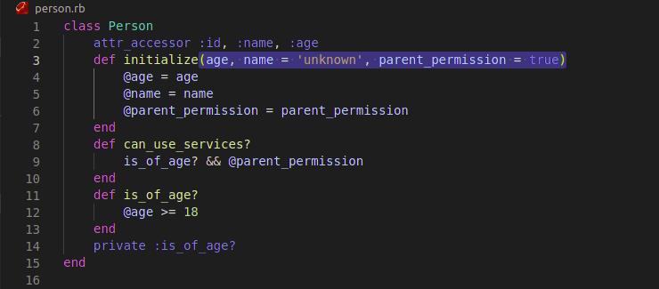

# OOP school library: add Person, Student and Teacher classes

> In this project, we will start building our school library app. In this initial step, we will implement the classes to represent students and teachers.

Additional description about the project and its features.

## Built With

- Ruby
- OOP

## Live Demo

[Live Demo Link](https://livedemo.com)

## Getting Started

To get a local copy up and running follow these simple example steps.
`
git clone https://github.com/azy64/school-library.git
`

### Run

open the terminal and run the following command
`
ruby main.rb
`

## Authors

👤 **Author1**

- GitHub: [@azy64](https://github.com/azy64)
- LinkedIn: [LinkedIn](https://www.linkedin.com/in/azaria-saidi-524780112/)

## 🤝 Contributing

Contributions, issues, and feature requests are welcome!

## Show your support

Give a ⭐️ if you like this project!

## Acknowledgments

- Hat tip to anyone whose code was used
- Inspiration
- etc

## 📝 License

This project is [MIT](./MIT.md) licensed.
